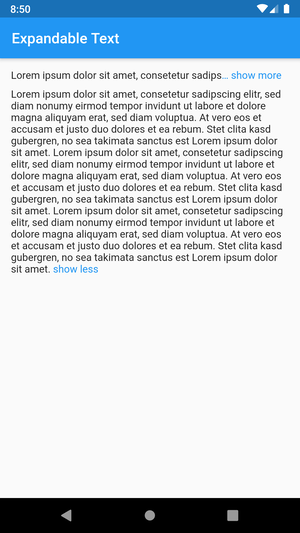

# expandable_text


[](https://pub.dev/packages/expandable_text)
[](https://github.com/fweinaug/expandable_text/blob/master/LICENSE)

This Flutter package includes the widget `ExpandableText` which you can use to initially only show a
defined number of lines of a probably long text. The widget appends a configurable text link which
let's the user expand the full text, or collapse it again.



## Getting Started

Add this to your package's pubspec.yaml file:

```
dependencies:
  expandable_text: 1.1.0
```

Next, import the package into your dart code:

```dart
import 'package:expandable_text/expandable_text.dart';
```

## Usage

Example which shows an expandable text if `longText` exceeds one line:

```dart
Widget build(BuildContext context) {
    return ExpandableText(
        longText,
        expandText: 'show more',
        collapseText: 'show less',
        maxLines: 1,
        linkColor: Colors.blue,
    );
}
```

## Bugs and feature requests

Have a bug or a feature request? Please first search for existing and closed issues.
If your problem or idea is not addressed yet, [please open a new issue](https://github.com/fweinaug/expandable_text/issues/new).

## Copyright & License

Code copyright 2020 Florian Weinaug.
Code released under the [MIT license](https://github.com/fweinaug/expandable_text/blob/master/LICENSE).
